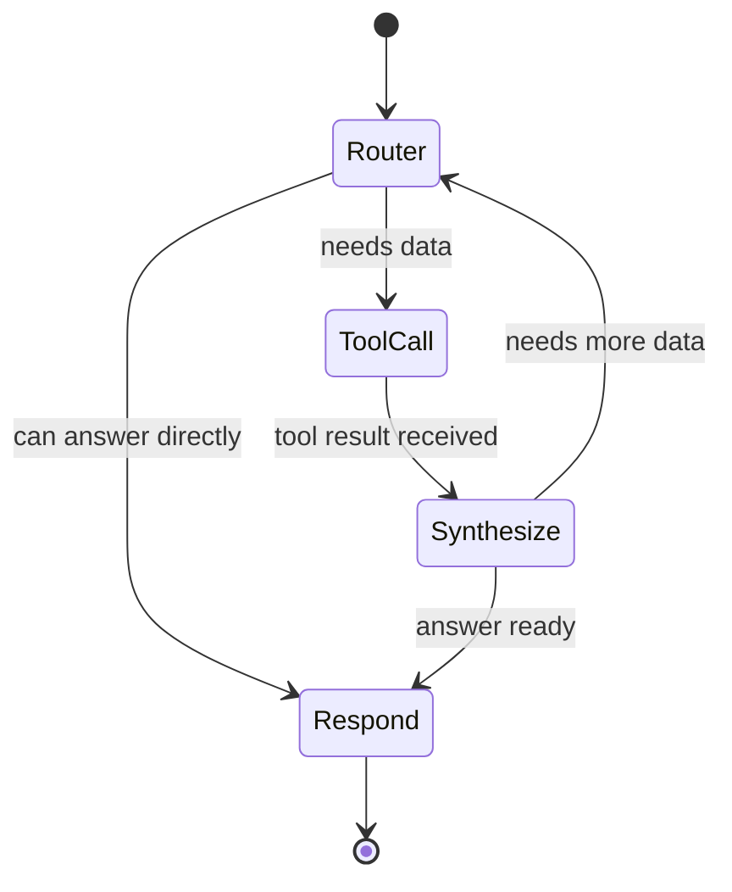
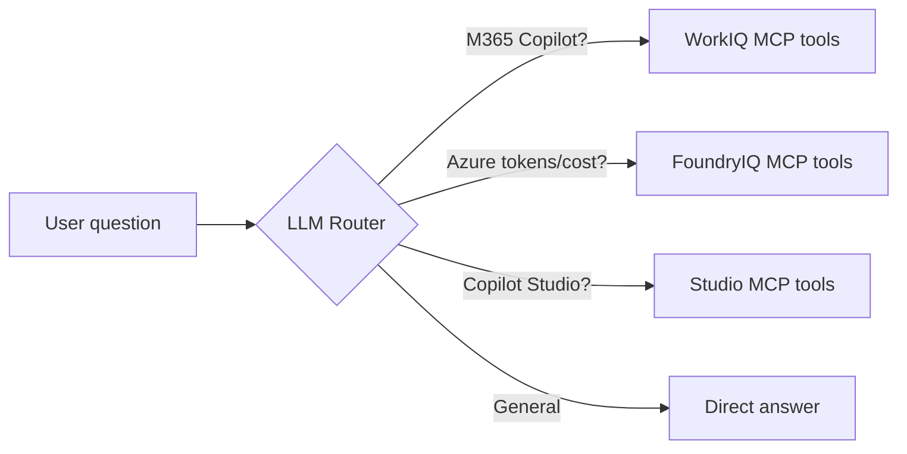

# Agent Flow (LangGraph)

## State machine

The agent follows a **ReAct** (Reason-Act) loop implemented as a LangGraph `StateGraph`.



## Nodes

| Node | Purpose |
|---|---|
| `router` | Examines the user message + conversation history. Decides: call a tool, or respond directly. |
| `tool_call` | Executes one or more MCP tool calls in parallel. Appends results to state. |
| `synthesize` | Reads tool results and decides if the answer is complete or if more tool calls are needed. |
| `respond` | Formats the final answer for the user. |

## State schema

```python
class AgentState(TypedDict):
    messages: Annotated[list, add_messages]   # LangGraph message list
    tool_results: list[dict]                  # raw MCP responses
    iteration: int                            # loop guard (max 5)
```

## Tool routing

The LLM sees a tool manifest that includes all MCP tools from the three servers:



## Example trace

**User**: "How many Copilot-enabled users do we have, and what's our Azure AI spend this month?"

| Step | Node | Action |
|---|---|---|
| 1 | router | Needs two data sources → parallel tool calls |
| 2 | tool_call | `workiq.get_copilot_usage_summary()` + `foundryiq.get_subscription_cost(period="this_month")` |
| 3 | synthesize | Both results received. Answer is complete. |
| 4 | respond | "You have 1,240 Copilot-enabled users. Azure AI spend this month is $8,320 across 3 subscriptions." |

## Streaming

The `respond` node streams tokens via LangGraph's `.astream_events()`. The FastAPI endpoint converts this into Server-Sent Events (SSE) consumed by the React chat panel.
