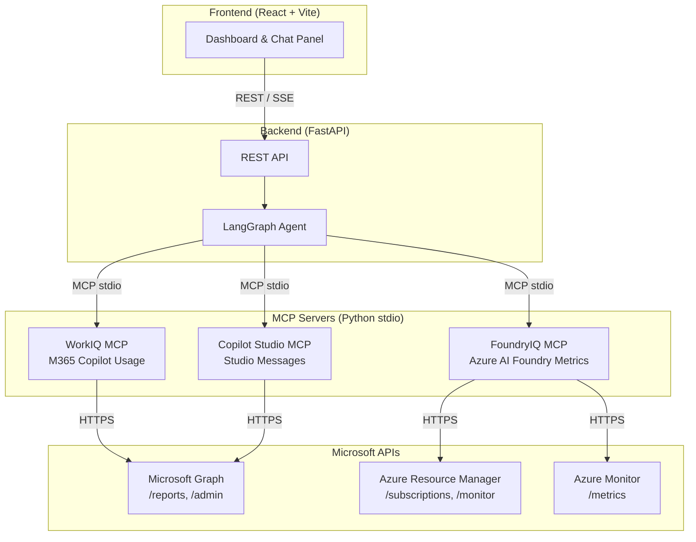
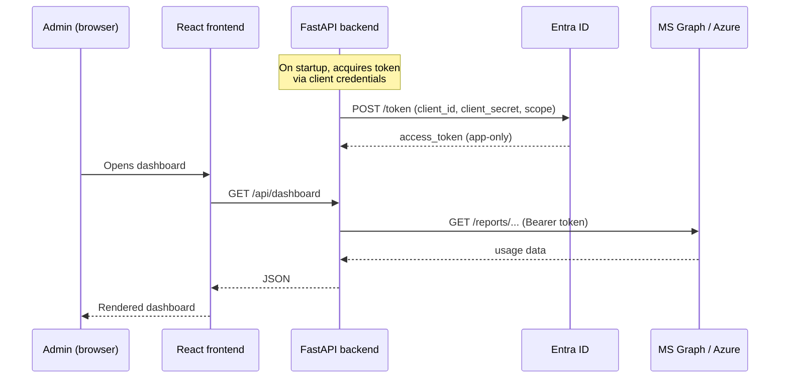
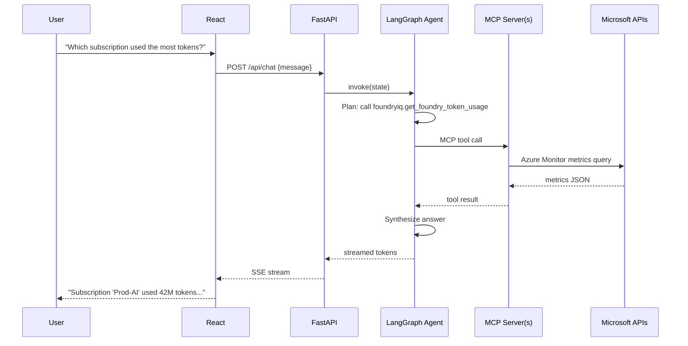

# Architecture

## High-level overview

## Component responsibilities

| Component | Responsibility |
|---|---|
| **React UI** | Renders KPI cards, charts, subscription table. Hosts a chat panel for ad-hoc questions. Calls `/api/dashboard` for initial load and `/api/chat` for agent interactions. |
| **FastAPI backend** | Serves REST endpoints. Owns the LangGraph agent lifecycle. Manages MCP server subprocesses. |
| **LangGraph agent** | Orchestrates multi-step reasoning. Routes user questions to the appropriate MCP tool(s), synthesizes answers, and streams tokens back via SSE. |
| **WorkIQ MCP** | Wraps Microsoft Graph report APIs for M365 Copilot: `getM365AppUserDetail`, `getMicrosoft365CopilotUsageReport`. Exposes MCP tools: `get_copilot_usage_summary`, `get_copilot_user_detail`, `get_copilot_app_usage`. |
| **FoundryIQ MCP** | Wraps Azure Monitor metrics and ARM resource queries scoped to Azure AI Foundry (Azure OpenAI, AI Studio). Exposes: `get_foundry_token_usage`, `get_foundry_transactions`, `list_ai_resources`, `get_subscription_cost`. |
| **Copilot Studio MCP** | Wraps Power Platform / Graph APIs for Copilot Studio analytics. Exposes: `get_studio_message_usage`, `get_studio_agents`. |

## Authentication flow

## Data flow for a chat question

## Technology stack

| Layer | Tech | Why |
|---|---|---|
| Frontend | React 18, Vite, TypeScript, Recharts | Fast HMR, modern charting, strong typing |
| Backend | FastAPI, Python 3.12 | Async-native, auto OpenAPI spec |
| Agent | LangGraph, LangChain, Azure OpenAI | State-machine agent with tool use |
| MCP protocol | `mcp` Python SDK (stdio transport) | Standardized tool exposure |
| Auth | `azure-identity` ClientSecretCredential | Service principal, auto token refresh |
| Azure queries | `azure-mgmt-monitor`, ARM REST | Metrics + resource discovery |
| Graph queries | `msgraph-sdk` | Official Python SDK for Graph |
