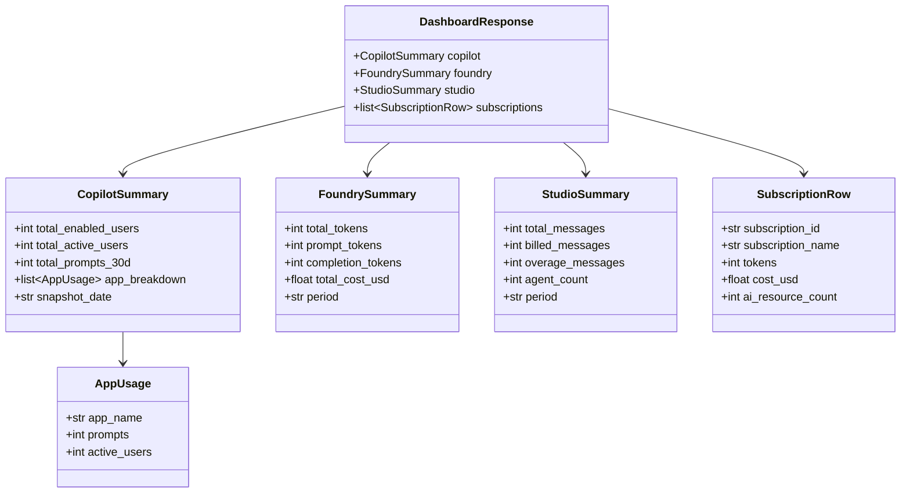

# Data Model

## Dashboard API response

The `/api/dashboard` endpoint returns a single JSON payload consumed by the React frontend.



## Chat API

### Request

```json
POST /api/chat
{
  "message": "Which app has the most Copilot prompts?",
  "conversation_id": "uuid-optional"
}
```

### Response (SSE stream)

```
event: token
data: {"content": "Teams"}

event: token
data: {"content": " leads with"}

event: done
data: {"conversation_id": "uuid"}
```
