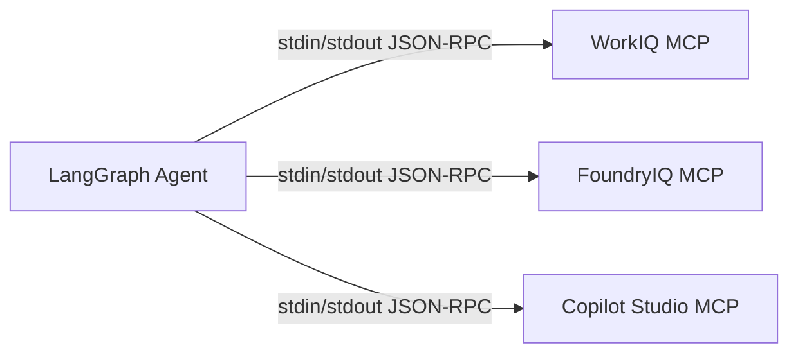

# MCP Servers

The agent communicates with three Model Context Protocol (MCP) servers over stdio transport. Each server exposes a focused set of tools.

## Transport



Each server is launched as a subprocess by the FastAPI backend. The `mcp` Python SDK handles framing.

---

## WorkIQ MCP (M365 Copilot Usage)

**Source APIs**: Microsoft Graph `/reports` beta endpoints.

| Tool | Description | Graph API |
|---|---|---|
| `get_copilot_usage_summary` | Total enabled users, active users, total prompts (7d / 30d) | `GET /reports/getMicrosoft365CopilotUsageReport` |
| `get_copilot_user_detail` | Per-user breakdown: last activity date, apps used, prompt count | `GET /reports/getMicrosoft365CopilotUserDetail` |
| `get_copilot_app_usage` | Prompts broken down by app (Teams, Outlook, Word, Excel, PPT) | Derived from user detail rollup |

### Example tool call

```json
{
  "tool": "get_copilot_usage_summary",
  "arguments": { "period": "D30" }
}
```

### Example response

```json
{
  "period": "D30",
  "total_enabled_users": 1240,
  "total_active_users": 876,
  "total_prompts": 34521,
  "snapshot_date": "2026-04-22"
}
```

---

## FoundryIQ MCP (Azure AI Foundry)

**Source APIs**: Azure Monitor metrics API + Azure Resource Manager.

| Tool | Description | Azure API |
|---|---|---|
| `list_ai_resources` | Enumerate Azure OpenAI / AI Services resources across subscriptions | ARM `GET /subscriptions/{id}/resources?$filter=type eq 'Microsoft.CognitiveServices/accounts'` |
| `get_foundry_token_usage` | Tokens in/out for a resource or subscription over a time range | Azure Monitor `GET .../{resourceId}/providers/microsoft.insights/metrics?metricnames=TokenTransaction` |
| `get_foundry_transactions` | Transaction units (PTUs consumed, standard calls) | Azure Monitor metrics `ProcessedPromptTokens`, `GeneratedCompletionTokens` |
| `get_subscription_cost` | Cost roll-up from Azure Cost Management | Cost Management query API |

### Example tool call

```json
{
  "tool": "get_foundry_token_usage",
  "arguments": {
    "subscription_id": "aaaa-bbbb-cccc",
    "period": "last_7d"
  }
}
```

### Example response

```json
{
  "subscription_id": "aaaa-bbbb-cccc",
  "subscription_name": "Prod-AI",
  "period": "last_7d",
  "total_prompt_tokens": 12400000,
  "total_completion_tokens": 6200000,
  "total_tokens": 18600000,
  "resources": [
    {
      "name": "aoai-eastus-prod",
      "prompt_tokens": 8100000,
      "completion_tokens": 4050000
    }
  ]
}
```

---

## Copilot Studio MCP

**Source APIs**: Microsoft Graph + Power Platform admin APIs.

| Tool | Description | API |
|---|---|---|
| `get_studio_message_usage` | Total messages consumed, billed messages, overage (period) | Power Platform admin / Graph reports |
| `get_studio_agents` | List of published Copilot Studio agents with last-active date | Power Platform environment listing |

### Example tool call

```json
{
  "tool": "get_studio_message_usage",
  "arguments": { "period": "current_month" }
}
```

### Example response

```json
{
  "period": "2026-04",
  "total_messages_consumed": 15230,
  "billed_messages": 12800,
  "included_in_license": 10000,
  "overage_messages": 2800,
  "agents": 14
}
```

---

## Mock mode

When `USE_MOCK_DATA=true`, each server returns fixtures from `backend/mcp_servers/fixtures/`. This lets you test the full agent loop without tenant credentials.

## Adding a new MCP server

1. Create `backend/mcp_servers/my_server.py` using the `@mcp.tool()` decorator pattern.
2. Add fixtures in `backend/mcp_servers/fixtures/my_server/`.
3. Register the command in `.env` and `backend/config.py`.
4. The LangGraph agent auto-discovers tools at startup via `langchain-mcp-adapters`.
